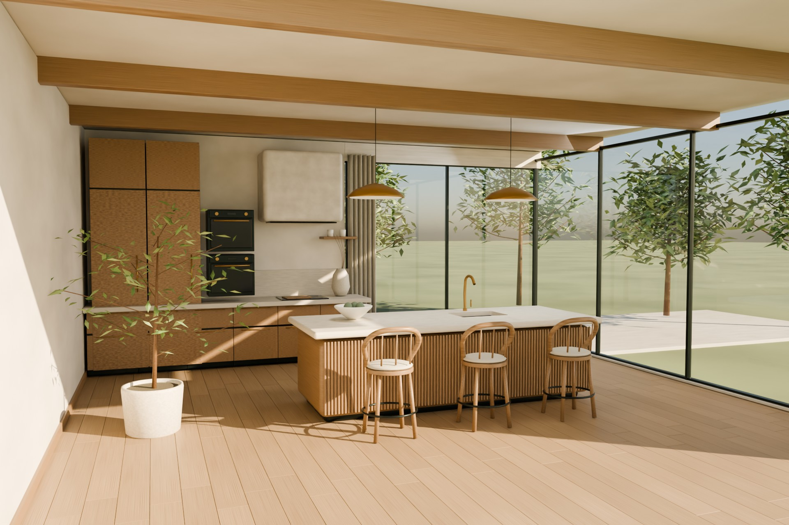
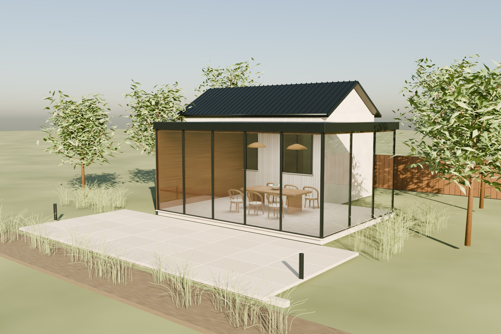

# NORTHLINE
### Material & Space — a design-and-build website, with the working process behind it.

An editorial WordPress block theme, a focused project-planning plugin, and six original Blender architectural studies. This is a fictional premium renovation practice: no client commissions, awards or testimonials are invented.



## The experience

The homepage pairs large architectural typography with a continuous photographic spread, a forest-green service section, an asymmetric project index and an interactive material library. The new visual layer extends to project pages, the six-step planner, private receipt, consultation desk and mobile layouts. It does not replace the original business workflow.

The material library presents three original close-up studies: reeded oak joinery, honed limestone with a genuinely recessed basin, and limewashed surfaces. Native buttons support Enter and Space, selected states are announced, and all studies remain readable when JavaScript is disabled. Motion honours the visitor's reduced-motion preference.

## Design foundations

`creative/material-space.tokens.json` is the shared foundation. `python3 tools/build-design.py` generates the committed CSS custom properties. Color roles, typography, shape, spacing and interaction states adapt [Material Design 3](https://m3.material.io/) and [Material Web theming](https://material-web.dev/theming/material-theming/) to NORTHLINE's own forest, clay and limestone palette. This is a brand-specific implementation, not a stock Material dashboard or an accessibility-certification claim.

**Figma status:** the [Material & Space design file](https://www.figma.com/design/pK6rEgw84SKQMcF8jAhJln) was created, but the connected Starter-plan MCP quota blocked canvas reads and writes on September 30, 2026. It is not a completed Figma design. The implemented source, tokens and design documentation are preserved here; no Figma completion is implied.

## Original 3D assets



The revision-2 Blender studio constructs the scenes from editable geometry rather than borrowing stock interiors. Details include bevelled joinery, reeded island fronts, bent-timber stools, upholstered cushions and piping, hollow ceramics, brass mixers, glazing mullions and gaskets, standing-seam roofs, timber soffits, pavers and individual leaf geometry.

`creative/models/` contains six editable `.blend` scenes after the architecture publisher completes. `theme/northline/assets/images/*-provenance.json` records renderer, dimensions, samples, camera and image SHA-256 hashes. Existing/proposed views must use the exact same camera. The three material studies have separate render manifests. No downloaded texture pack or add-on is needed to regenerate them.

```bash
blender -b -t 4 --python-exit-code 1 -P tools/render_architecture.py -- \
  --project 0 --samples 96 --width 1920 --output rendered/images --blend-dir rendered/models
blender -b -t 4 --python-exit-code 1 -P tools/render_detail.py -- \
  --detail oak --samples 96 --width 1600 --output rendered/images
```

Projects 0–5 are Birch, Tidal, Alder, Orchard, Courtyard and Harbour House. The CI studio pins and checksum-verifies Blender 4.2.15. House pairs and material details run independently so a single hero job does not have to render five images before it can publish an artifact.

## Run the browser demonstration

PHP 8.2+ and Python 3 are required. There is no frontend build framework or runtime npm dependency.

```bash
php tools/build-preview.php
python3 -m http.server 8080 --bind 127.0.0.1 --directory preview
```

Open `http://127.0.0.1:8080`. The preview contains 17 routes. Enquiries in this demonstration are browser-local fixtures: **no real email is sent and no real consultation is booked**. Use fictional contact information and non-sensitive reference images.

## Run WordPress

Follow [the local WordPress guide](docs/LOCAL-WORDPRESS.md) for Docker, the private test inbox and the email-failure demonstration. Install `theme/northline` and `plugins/northline-planner`, activate both, then run:

```bash
wp northline seed
```

The seed command never overwrites existing edited pages. On an existing installation, use `wp northline design-draft` to create the redesigned homepage as a **new draft**, review it, then choose whether to publish it. The complete homepage also appears as a native block pattern in the NORTHLINE editorial category. The material library has an editable heading in the block inspector.

The production plugin retains server validation, private reference uploads, save-first enquiries, idempotency, email outbox retries, consultation-slot conflict handling, staff notes, and privacy export/erasure. The planner gives illustrative allowances with explicit assumptions, not a construction quotation.

## Tests and deliverables

```bash
php tests/domain.php
php tests/design.php
# Serve the preview on port 8091 before browser checks:
npm install --no-save --package-lock=false playwright@1.55.1
npx playwright install chromium
node tests/design.cjs
node tests/browser.cjs
python3 tools/package.py
```

The quality workflow also provisions an isolated real WordPress/MySQL installation, runs integration tests, checks all 17 preview routes and six viewport widths, exercises keyboard/material/mobile-menu controls, and runs the mobile-to-staff enquiry journey. It uploads screenshots, logs, test results and installable packages as `northline-verified-build`. Inspect the relevant run's outcome rather than treating a workflow definition as evidence that it passed.

Packages in `dist/`: `northline-theme.zip`, `northline-planner-plugin.zip`, and `northline-browser-demo.zip`. `dist/manifest.json` records package sizes and SHA-256 hashes. The browser demonstration is not a substitute for the WordPress backend.
